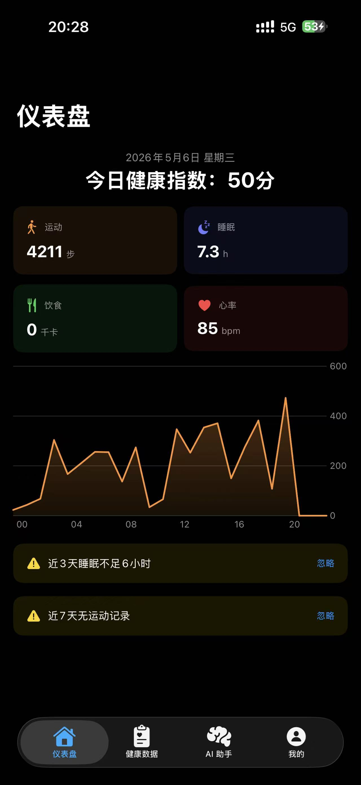
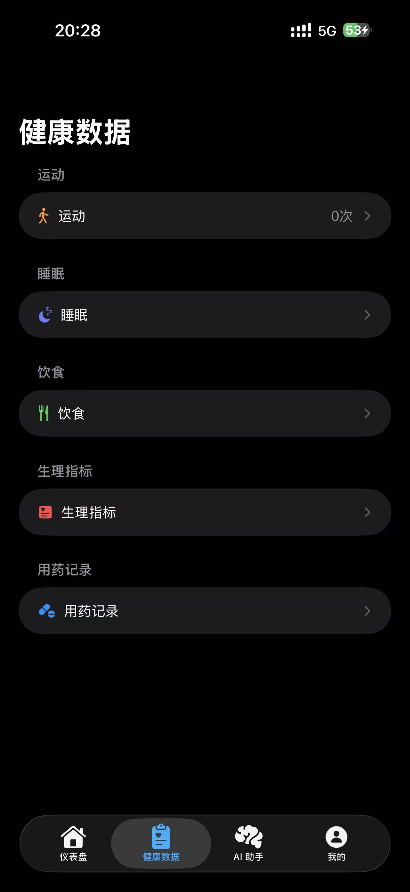
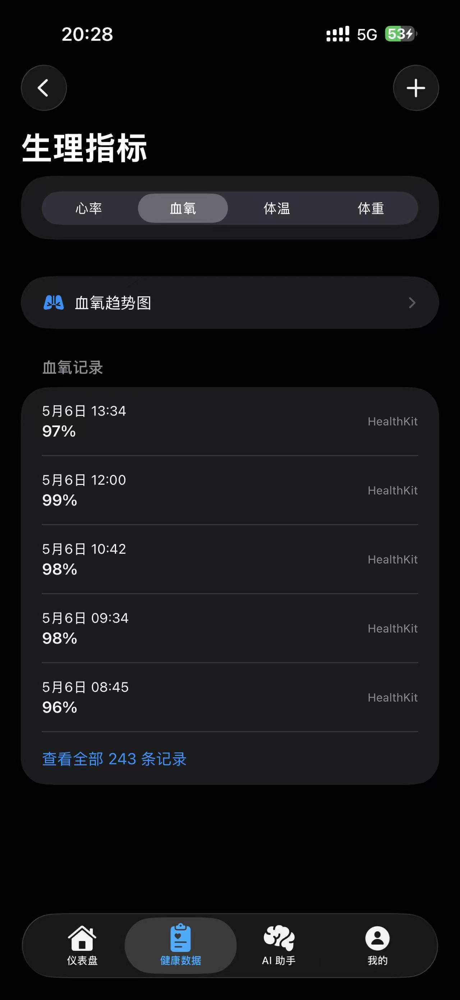
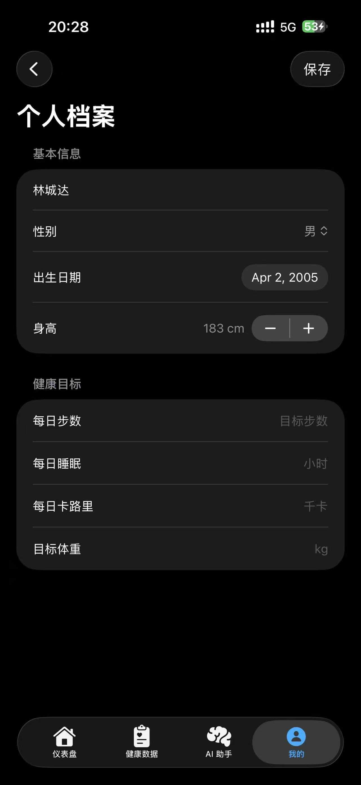
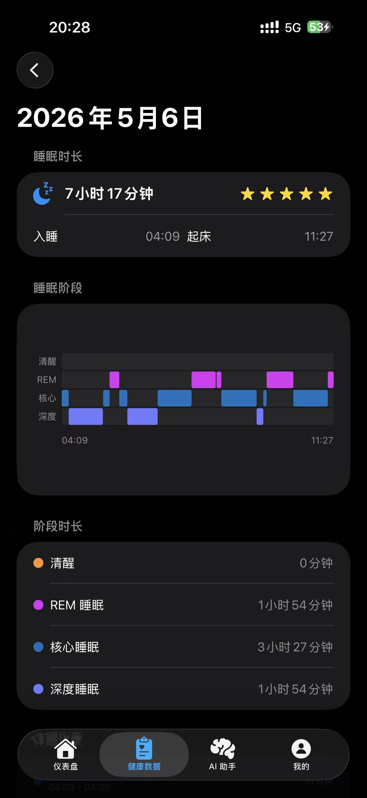
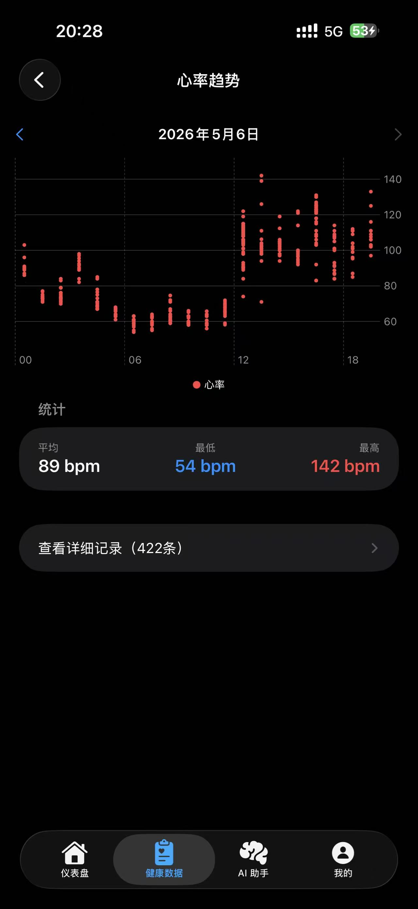
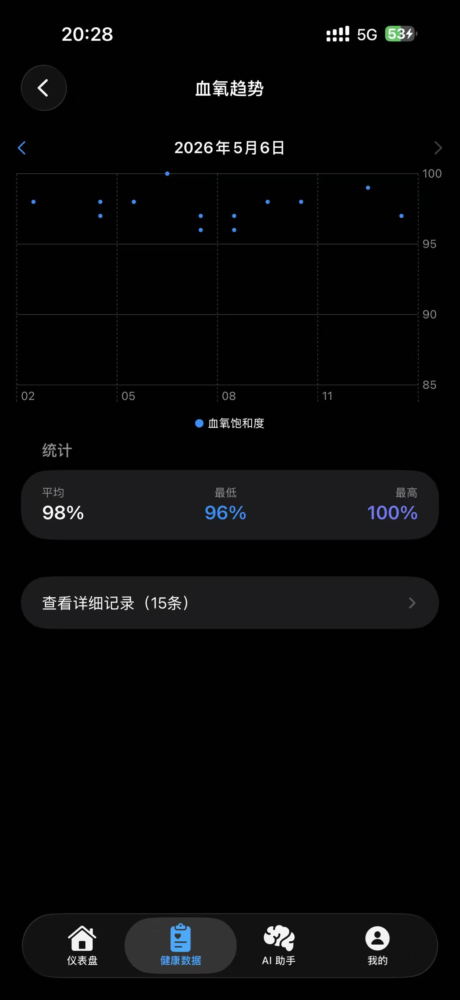
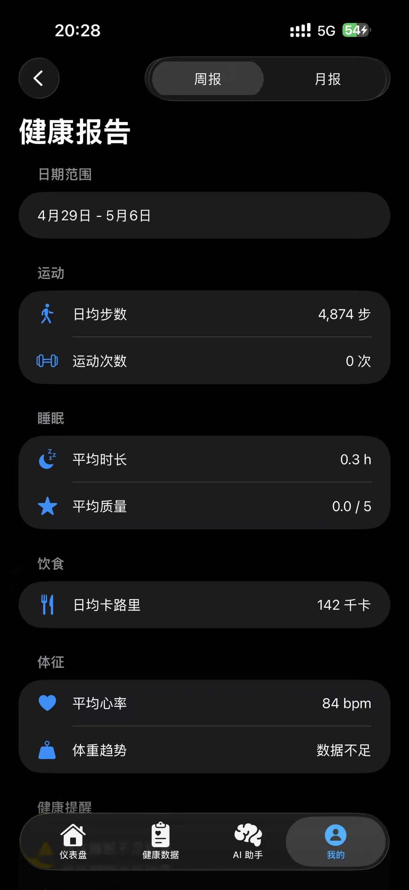
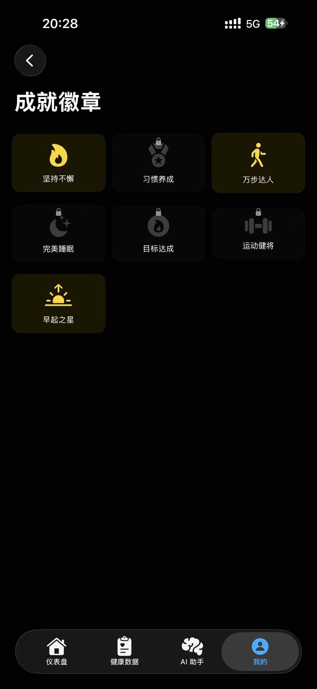

<p align="center">
  
</p>

<h1 align="center">HealthFlow</h1>

<p align="center">
  <strong>个人健康数据管理与可视化 iOS 应用</strong>
</p>

<p align="center">
  
  
  
  
  
</p>

---

## 📖 简介

HealthFlow 是一款面向 iOS 平台的个人健康管理应用，集成了 **HealthKit** 健康数据采集、**SwiftData** 本地持久化、**AI 智能分析** 和 **数据可视化** 等核心能力。帮助用户一站式管理运动、睡眠、饮食、生理指标等健康数据，并通过 AI 助手提供个性化的健康建议。

## ✨ 功能特性

### 🏠 健康仪表盘
- 今日健康指数综合评分
- 步数、睡眠、饮食、心率四大核心指标卡片
- 24 小时活动趋势折线图
- 健康风险预警提示

### 📊 健康数据管理
| 模块 | 功能 |
|------|------|
| **运动记录** | 记录运动类型、时长、消耗卡路里，支持多种运动类型 |
| **睡眠监测** | 睡眠时长追踪、睡眠质量分析 |
| **饮食记录** | 内置食物数据库、营养成分查询、餐次分类管理 |
| **生理指标** | 心率、血氧、血压、血糖、体温等多维度指标记录与趋势图表 |
| **用药管理** | 药物名称、剂量、服药时间记录 |

### 🤖 AI 健康助手
- 对话式交互，随时获取健康建议
- 快捷提问模板，一键获取常见健康问题解答
- 支持自定义 API 配置（兼容 OpenAI 兼容接口）
- 基于个人健康数据的智能分析

### 🏆 成就系统
- 健康习惯养成徽章
- 运动、睡眠、饮食多维度成就解锁

### 👤 个人中心
- 个人档案管理（身高、体重、年龄等）
- 健康报告生成与查看
- 数据导出（CSV 格式）
- 预警历史管理

### 🔒 隐私与安全
- Face ID / Touch ID 生物识别锁屏
- API Key 安全存储（Keychain）
- 数据完全本地化，不上传至任何服务器

## 📸 应用截图

<p align="center">
  
  
  
  
  
</p>
<p align="center">
  
  
  
  
  
</p>

## 🏗️ 项目架构

```
HealthFlow/
├── Definition/          # 枚举与类型定义
│   ├── ExerciseType     # 运动类型
│   ├── MealType         # 餐次类型
│   ├── MetricType       # 生理指标类型
│   └── ...
├── Model/               # SwiftData 数据模型
│   ├── UserProfile      # 用户档案
│   ├── WorkoutRecord    # 运动记录
│   ├── SleepRecord      # 睡眠记录
│   ├── DietRecord       # 饮食记录
│   ├── FoodItem         # 食物条目
│   ├── PhysiologicalMetric  # 生理指标
│   ├── AchievementBadge # 成就徽章
│   ├── ChatMessage      # AI 对话消息
│   └── ...
├── Service/             # 服务层
│   ├── HealthKitManager # HealthKit 数据采集
│   ├── AIService        # AI 接口调用
│   ├── FoodDatabaseService  # 食物数据库
│   ├── ExportService    # 数据导出
│   ├── KeychainService  # Keychain 安全存储
│   ├── ImageStorageService  # 图片存储
│   └── SyncEngine       # 数据同步引擎
├── Utility/             # 工具类
│   ├── HealthCalculator # 健康指标计算
│   ├── CSVEncoder       # CSV 编码器
│   └── Constants        # 常量定义
├── View/                # SwiftUI 视图层
│   ├── Dashboard/       # 仪表盘
│   ├── HealthData/      # 健康数据详情
│   ├── AIAssistant/     # AI 助手
│   ├── Profile/         # 个人中心
│   ├── Privacy/         # 隐私锁屏
│   └── Component/       # 可复用组件
├── ViewModel/           # MVVM ViewModel 层
└── Resource/            # 资源文件
```

## 🛠️ 技术栈

| 技术 | 用途 |
|------|------|
| **Swift 5.9** | 主要开发语言 |
| **SwiftUI** | 声明式 UI 框架 |
| **SwiftData** | 本地数据持久化 |
| **HealthKit** | Apple 健康数据读写 |
| **Charts** | 数据可视化图表 |
| **LocalAuthentication** | Face ID / Touch ID 认证 |
| **Security (Keychain)** | 敏感数据安全存储 |
| **MVVM** | 应用架构模式 |

## 🚀 快速开始

### 环境要求

- macOS 14.0+
- Xcode 16.0+
- iOS 17.0+ 真机或模拟器

### 安装与运行

1. **克隆仓库**
   ```bash
   git clone https://github.com/your-username/HealthFlow.git
   cd HealthFlow
   ```

2. **打开项目**
   ```bash
   open HealthFlow.xcodeproj
   ```
   或者使用 Xcode 直接打开 `HealthFlow.xcodeproj` 文件。

3. **选择目标设备**
   
   在 Xcode 中选择 iPhone 模拟器或连接的 iOS 真机（iOS 17.0+）。

4. **运行项目**
   
   按 `Cmd + R` 编译并运行。

> **注意**：HealthKit 相关功能需要在真机上测试，模拟器不支持完整的 HealthKit 数据读写。

### 配置 AI 助手

1. 进入 **我的** → **设置** → **API 配置**
2. 填入你的 API Key、API Endpoint 和 Model ID
3. 支持所有 OpenAI 兼容接口（如 OpenAI、DeepSeek 等）

## 🧪 测试

项目采用 **TDD（测试驱动开发）** 模式，包含完整的单元测试套件：

```bash
xcodebuild test \
  -project HealthFlow.xcodeproj \
  -scheme HealthFlow \
  -destination 'platform=iOS Simulator,name=iPhone 16'
```

### 测试覆盖范围

| 测试模块 | 覆盖内容 |
|----------|----------|
| **ModelTests** | 所有 SwiftData 模型的序列化、属性验证 |
| **DefinitionTests** | 枚举类型、原始值映射 |
| **ServiceTests** | AI 服务、数据导出、食物数据库、Keychain、HealthKit 模拟 |
| **ViewModelTests** | 各 ViewModel 的业务逻辑与状态管理 |

## 📁 项目结构说明

```
HealthFlow/
├── HealthFlow/              # 主工程源码
├── HealthFlowTests/         # 单元测试
├── HealthFlow.xcodeproj/    # Xcode 项目配置
├── docs/                    # 开发文档（设计文档、开发计划）
├── testimg/                 # 应用截图资源
├── project.yml              # XcodeGen 项目配置
└── README.md
```

## 🤝 贡献

欢迎提交 Issue 和 Pull Request！

1. Fork 本仓库
2. 创建你的特性分支 (`git checkout -b feature/AmazingFeature`)
3. 提交你的改动 (`git commit -m 'Add some AmazingFeature'`)
4. 推送到远程分支 (`git push origin feature/AmazingFeature`)
5. 打开一个 Pull Request

## 📄 许可证

本项目基于 MIT 许可证开源，详情请参阅 [LICENSE](LICENSE) 文件。

---

<p align="center">
  用 ❤️ 和 Swift 构建
</p>
